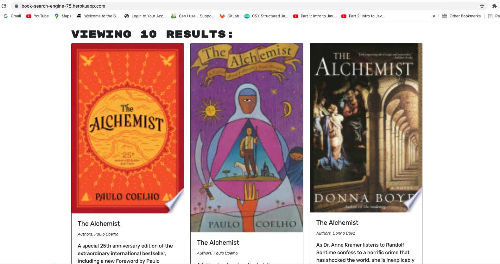

# book-search-engine
This app is a book search engine that uses third party API.

## Getting Started
* clone me, or fork me
  
🌎 live at: [book-search-engine link](https://book-search-engine-75.herokuapp.com/)

Screen shot of the deployed app:

## Deployment

Just deploy, no other actions needed

## Built With

* [React](https://reactjs.org/docs/getting-started.html)
  
* [React Bootstrap](https://react-bootstrap.github.io/)

* [CSS](https://developer.mozilla.org/en-US/docs/Web/CSS)
  
* [JavaScript](https://developer.mozilla.org/en-US/docs/Web/JavaScript)

## Acknowledgments
  - **Billie Thompson** - *README Template* -
    [PurpleBooth](https://github.com/PurpleBooth)